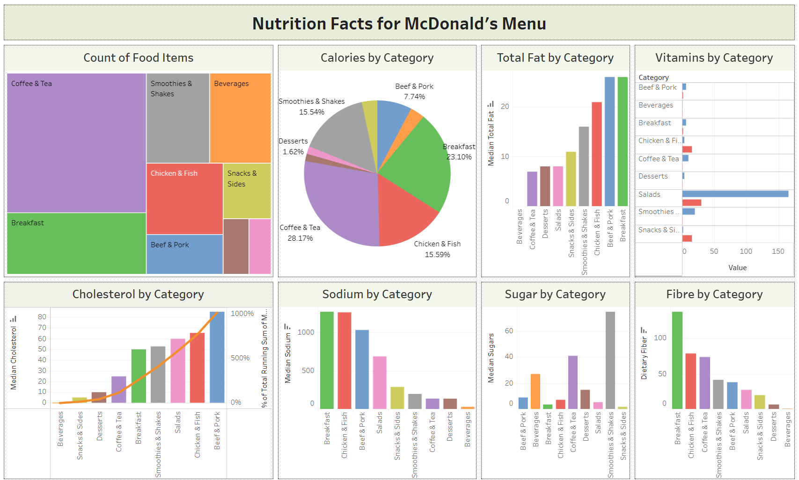

## 🍔 Nutrition Facts for McDonald's Menu

### 📌 Overview
This Tableau dashboard provides an in-depth visual analysis of the nutritional content of McDonald’s menu items across multiple categories. It helps in understanding the distribution of calories, fats, sugars, cholesterol, and other nutrients in commonly consumed fast-food items.

---

### 🎯 Problem Statement

Fast food is often associated with poor nutrition, but the actual nutrient distribution across items and categories is not always obvious. The key problems this project addresses are:

- **Which categories contribute most to calorie and fat intake?**
- **How do items vary in terms of sugar, sodium, and cholesterol?**
- **Which category is the most nutrient-dense or healthiest?**
- **What’s the distribution of food items across categories?**

---

### 💡 Objectives

- Visualize and compare key nutritional elements by food category.
- Identify high-risk categories (e.g., high sodium or sugar).
- Enable informed food choices for consumers and nutritionists.

---

### 📊 Key Insights

- **Coffee & Tea** and **Breakfast** items are the highest in calorie contributions.
- **Smoothies & Shakes** show the highest sugar content.
- **Beef & Pork** lead in cholesterol and fat levels.
- **Salads**, while fewer in number, contain high vitamin values.
- **Breakfast items** are highest in sodium and fibre.

---

### 📂 Dashboard Features

- **Treemap**: Count of food items by category
- **Pie Chart**: Calorie distribution across categories
- **Bar Charts**:
  - Total fat, cholesterol, sodium, sugar, and fibre by category
  - Vitamin values by category
- **Cumulative Analysis**: Cholesterol chart includes Pareto-style cumulative % line

---

### 🖼️ Dashboard Preview

